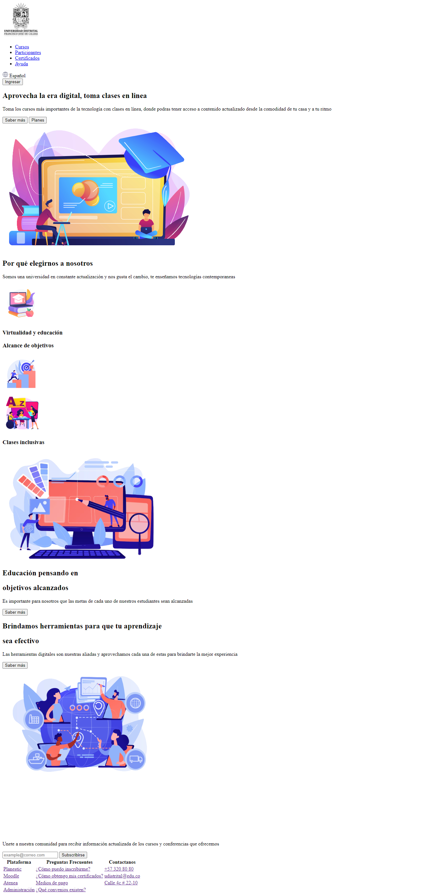

<h1>Taller 9 -Leydy Belén Mora Pérez</h1>

<h2>Información</h2>

Curso: Full Stack Básico - Grupo 1

Profesor: Cristian Patiño

<h2>Link de la página web</h2>

<h2>Punto 1: Link de Figma</h2>
<a href="https://www.figma.com/file/E1oHdHNTDN2JSURAtiJYXA/Leydy-Bel%C3%A9n-Mora-P%C3%A9rez?type=design&node-id=0-1&mode=design&t=67F4SxdlsA0b3VqA-0">link de figma</a>

<h2>Punto 2: Diseño en HTML</h2>

<h2>Punto 3: Diseño con CSS</h2>

<h2>Punto 4: Títulos</h2>

<h2>Punto 5: Párrafo</h2>

<h2>Punto 6: Links</h2>

<h2>Punto 7 y 8: Navegación</h2>

<h2>Punto 9: Tabla</h2>